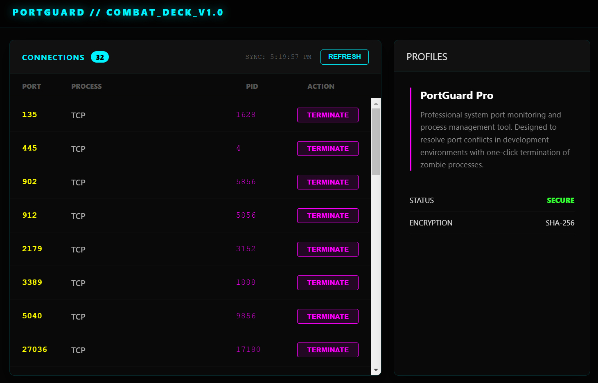

# PortGuard Pro

**PortGuard Pro** is an advanced system port monitoring and process management utility designed for developers.

### 🚀 Key Features
- **Real-time Monitoring**: Millisecond-level synchronization of all active network ports on your system.
- **Contextual Identification**: Clearly displays protocols, local addresses, and associated process PIDs.
- **Nuclear Termination**: Efficiently kill port-hogging or zombie processes common during development (e.g., `EADDRINUSE` errors).

### 🛠️ Quick Start
1. **Install Dependencies**: `npm install`
2. **Launch Tool**: `npm start`

### 🎨 Design Aesthetic
Featuring a high-end dark mode with neon accents, PortGuard Pro provides a powerful visual experience combined with smooth interactive animations.
